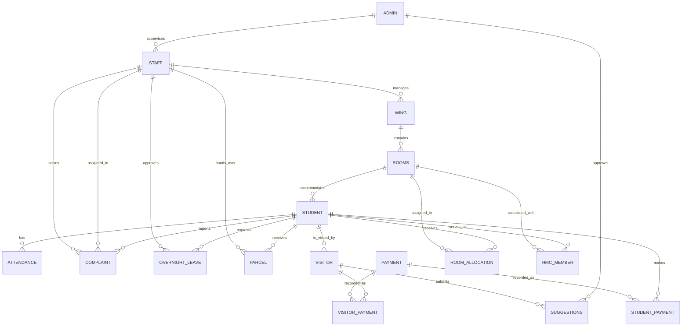

# ER Diagram

The following Mermaid diagram represents the relationships declared or implied by the current DDL.

## Note

The `STUDENT` to `VISITOR` relationship is logically implied by `Visitor.visited_student_id`, but the current DDL does not explicitly declare its foreign-key constraint.
